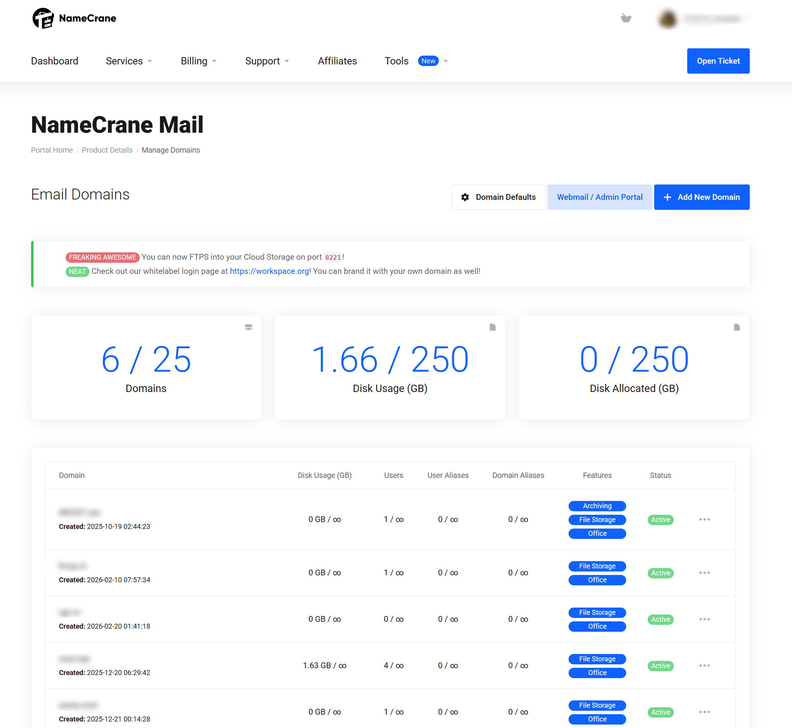
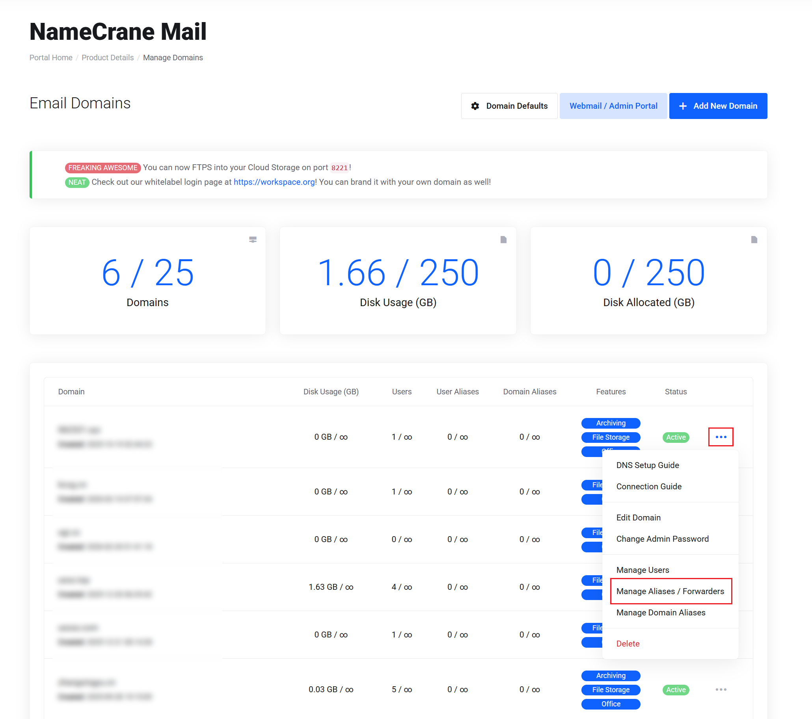
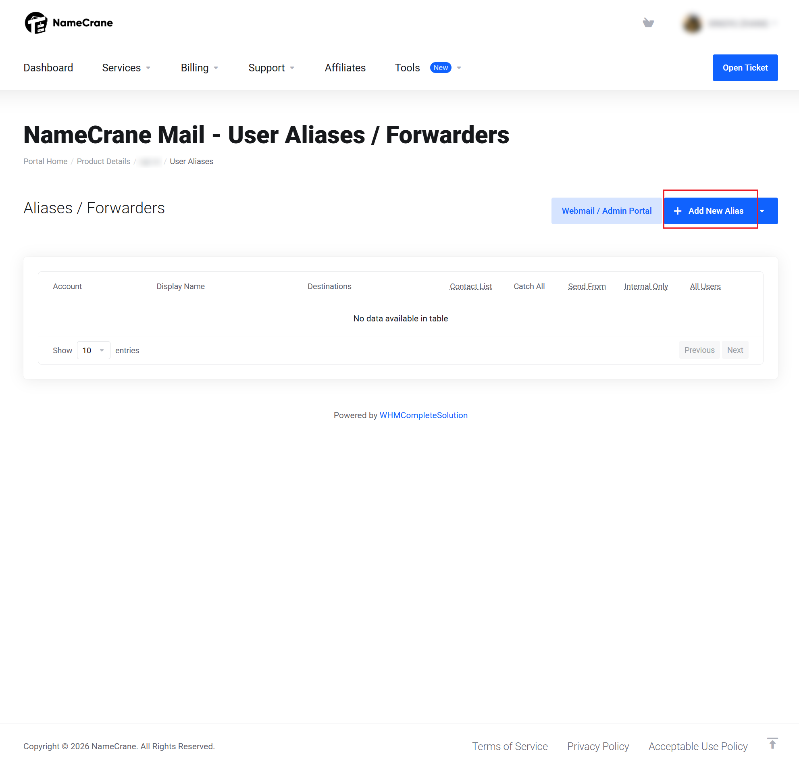
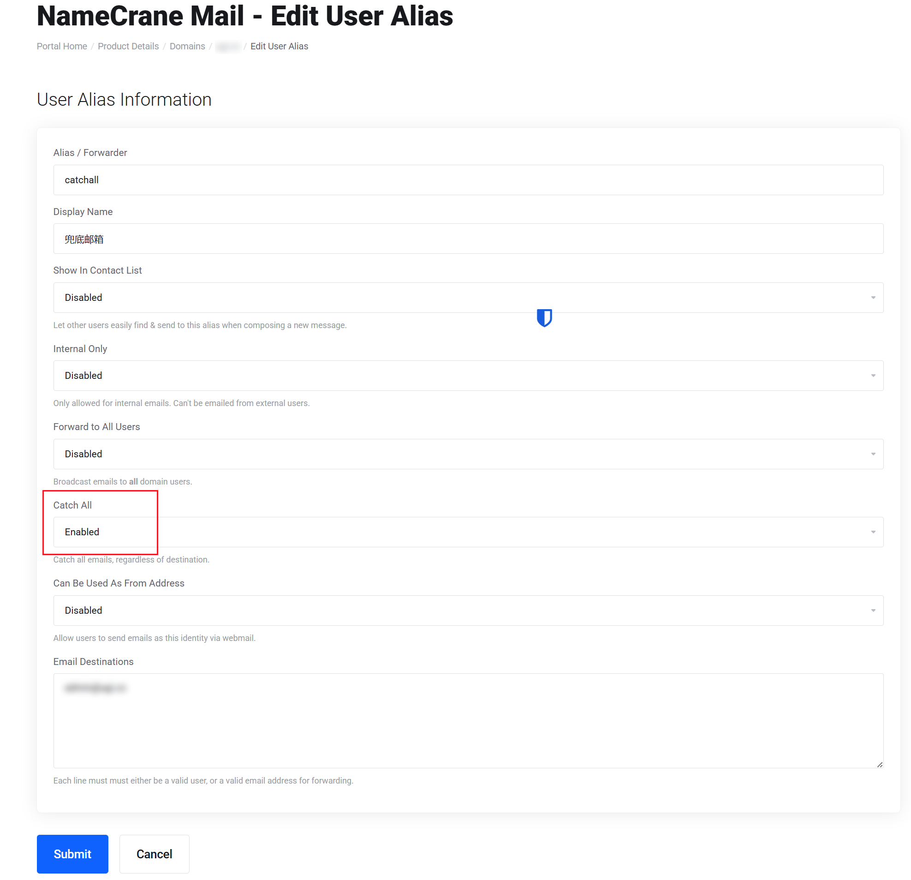

> 由于我懒得设置每一个邮箱的前缀，再加上有无限别名邮箱的需求，所以想着开启一下“全地址捕获”，但是发现全网没有一个这方面的教程（也可能是我太菜了

# 教程开始

## 首先打开NameCrane域名管理页面

如下图

选择你要修改的邮箱后面的三个点，选择 Manage Aliases/Forwarders

## 进入 “用户别名/转发器” 界面

选择添加新别名

## 按照以下步骤操作即可启用兜底地址：

### 1. 填写别名基础信息

- **Alias / Forwarder**: 输入一个别名名称，例如 `catchall`。
    
- **Display Name**: 随便填一个方便识别的名字，比如“兜底邮箱”。
    

### 2. 启用 Catch All (关键步骤)

- 找到页面中间的 **Catch All** 下拉菜单。
    
- 将状态从 **Disabled** 改为 **Enabled**。
    
- 系统会提示这会捕获所有发往该域名但不存在的地址的邮件。
    

### 3. 设置邮件去向

- 在底部的 **Email Destinations** 文本框中，输入你真正用来收信的邮箱地址（例如你的主邮箱）。
    
- 注意：每行只能输入一个地址。

### 如何验证是否成功？

设置完成后，你可以尝试使用别的邮箱（如Gmail，outlook mail等）给此邮箱随意一个前缀发送地址（例如：asdf@ example.com)如果能收到就是可以了~