那么重点来了，既然是浏览器，那么想必是可以像edge等那样，添加插件的，变得更加方便好用
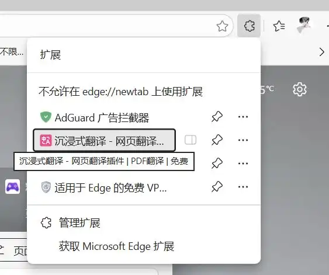
再结合Steam自身的特性，那么可以添加的插件，即**包括但不限于**

创意工坊助手，好评差评差异，卡牌卡组信息，游戏在linux及steamdeck上的运行表现，游戏盈利估计，常玩好友，url开放，语言一键翻译，价格史低情况，在线人数状态，媒体评分，个人资料美化，插件商店快捷键，游戏预览详细信息……等等等等，各种各样的插件任你挑选
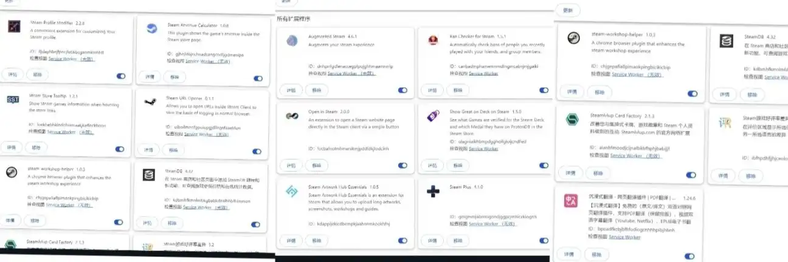

**这简直是Steam的创意工坊！**

那么预览完lz的插件界面，我们进入详细的教程环节

**首先第一步**

**加速**Steam，进入商店界面

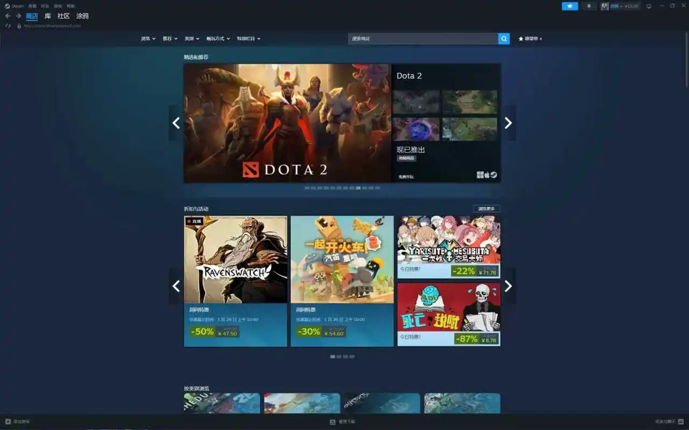

**接着第二步**

向下滑，随便找到一款游戏，**用鼠标中键点击**

（当然用右键也是可以的）

之后会额外弹出一个界面，此时上方的地址栏则处于可编辑状态

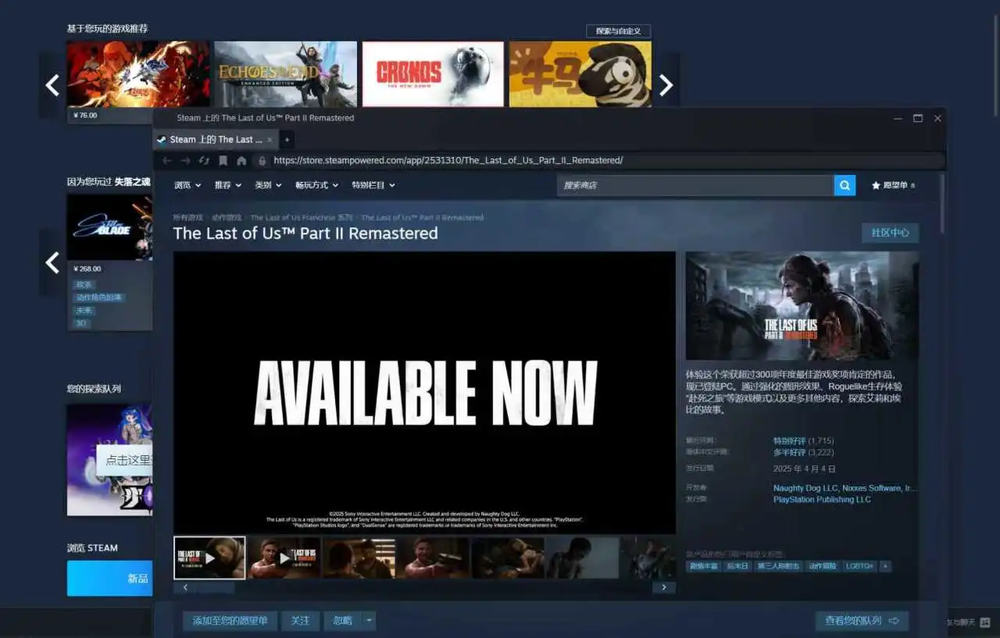

**然后第三步**

输入如下代码，进入扩展程序界面

chrome://extensions/

即可跳转进入
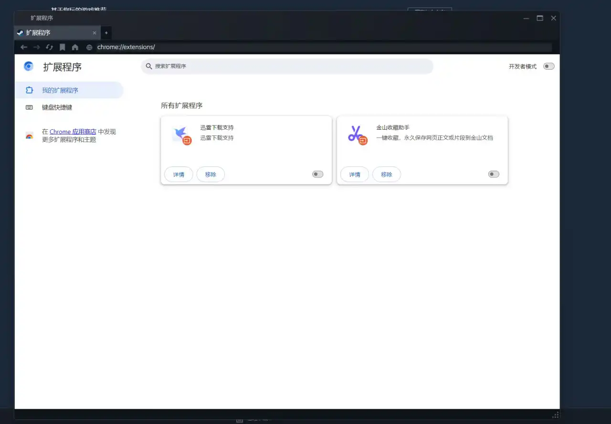

**此时下载扩展有两个方式**

一是在线下载（需要🪜），二是本地下载（无需🪜）

注意，加速Steam对这里是没有用的，所以需要额外的加速

**那么首先，在线下载**

非常简单，只需要点击左侧的“谷歌商店”即可顺利方便的添加插件

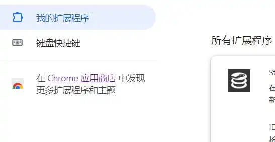

可是没有🪜怎么办呢？进不去Chrone应用商店

欸，说了有小道的嘛

**首先**，我们点击开启右上角的**开发者模式**，之后**退出Steam刷新启用**

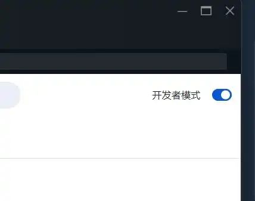

**随后，**在上方地址栏中，输入https://www.crxsoso.com/，即可进入另一个插件扩展网址——**Crx**

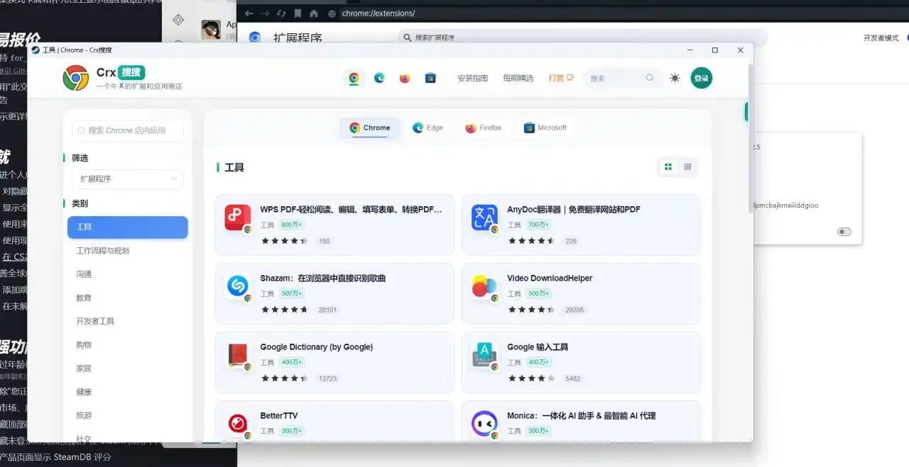

**再之后呢**

通过**搜索或翻阅**，选择自己想要添加的插件，点进去之后，进入绿色下载按钮旁的，**黄色“离线安装包下载”按钮**

推荐下载crx格式

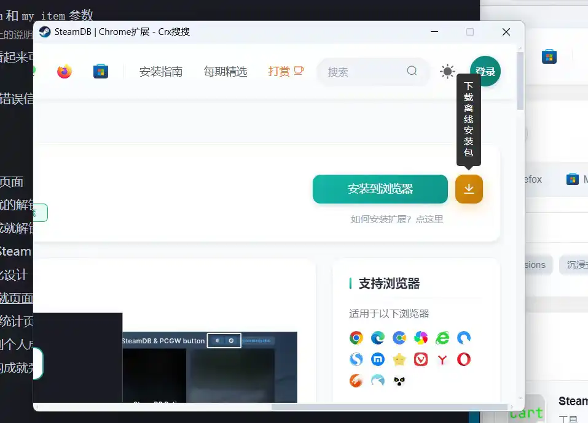

**最后**

将下载完成的安装包拖入Steam插件安装界面，即可完成在Steam上的插件安装

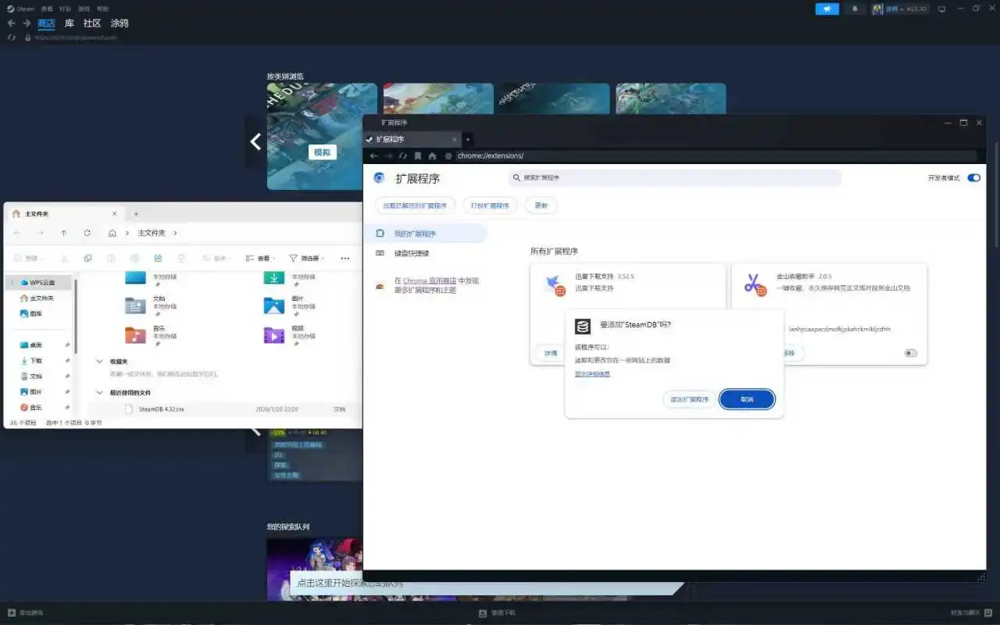

添加完毕之后，回到Steam主界面**刷新**，就可以看到生效啦
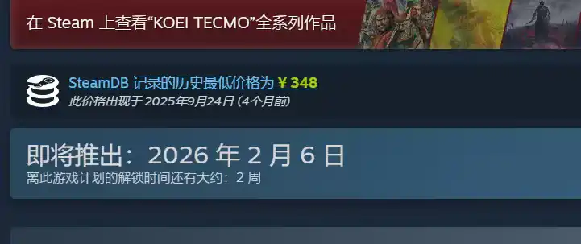

那么之后，可能有hy要问了“有没有啥必装的插件呢？”有的，兄弟，有的

这里推荐几个好用的Steam插件，因为篇幅原因，lz打包好了放在了**评论区**

**[注意：不要装油猴和篡改猴之类的插件，会导致Steam崩溃打不开]**

这里首先给出一个示例

一、沉浸式翻译
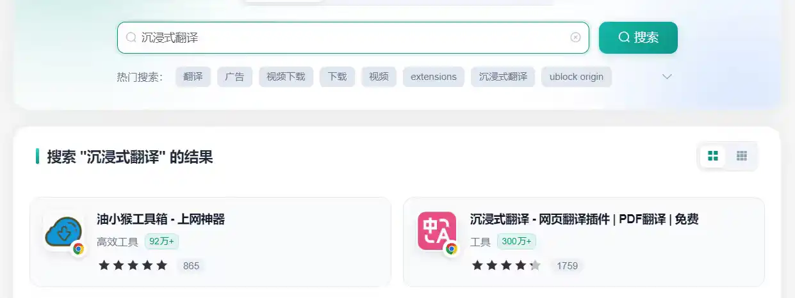
还在为Steam的游戏资源介绍没有英文而苦恼吗？有了这个插件，即可轻松一键实现多种语言翻译，再也不用因看不懂烦恼

二、SteamDB

在 Steam 商店和社区页面中添加 SteamDB 链接和新功能，可查阅游戏史低价格和在线统计数据。
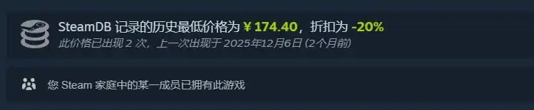

以及……

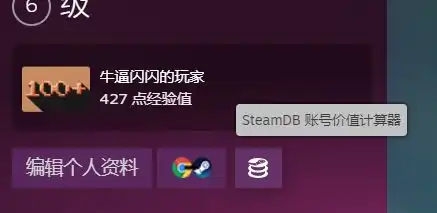

三、Steam游戏好评率差异

在评价区域显示所选语言的好评率，占比，以及和另一所选语言的差异
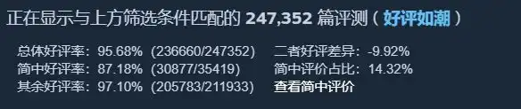

四、Steamlvlup Card Factory

改善您与集换式卡牌、游戏徽章和 Steam 个人资料级别的互动. Steamlvlup.com 的官方网络扩展

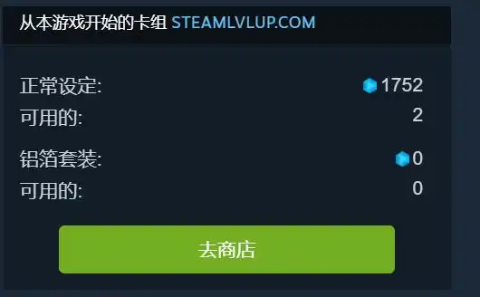

五、Steam Artwork Hub Essentials

是 Steam 的网络浏览器扩展，可让您轻松地将长艺术作品和装饰性长屏幕截图、研讨会和指南上传Steam 网络，而无需使用任何上传代码。

该扩展还提供了新的个人资料主题和按钮，可与 Steam 积分商店、Steam 市场和您的 Steam 库存集成。
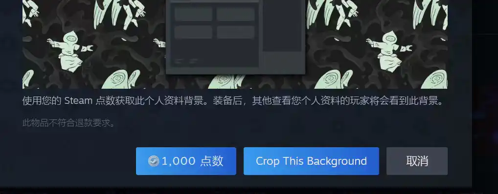

六、Steam Revenue Calculator

查看游戏估计盈利

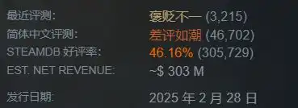

七、Open in Steam

在Steam的大部分界面右上角加上进入扩展界面的快捷键（需要🪜）

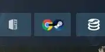

八、SteamPlus

是一个可以增强您的 Steam 体验的扩展（如 Steam 库存助手、Csgofloat 或 Csgotrader.app）

主要作用于市场交易
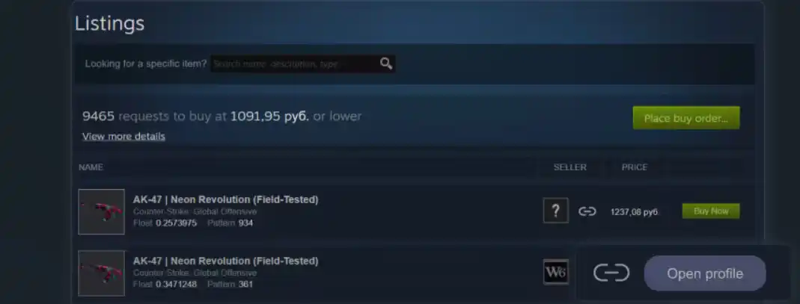

                                        本文由小黑盒作者：心令言 原创
