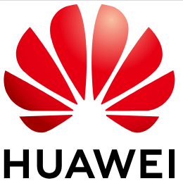
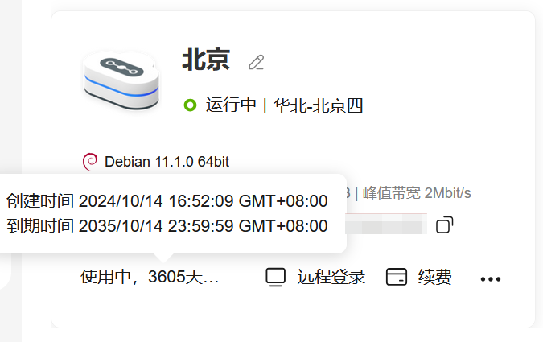
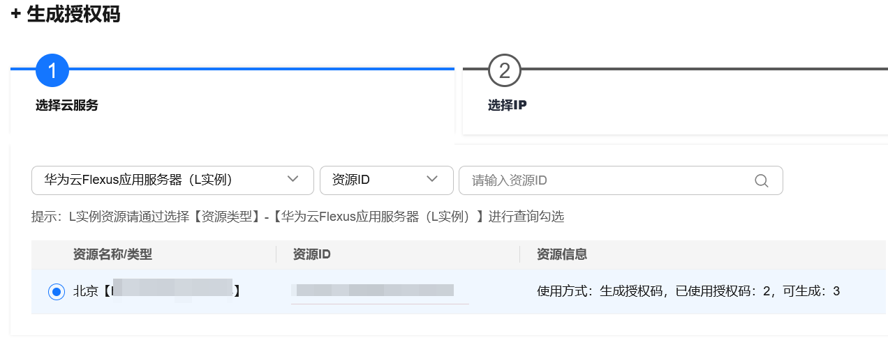
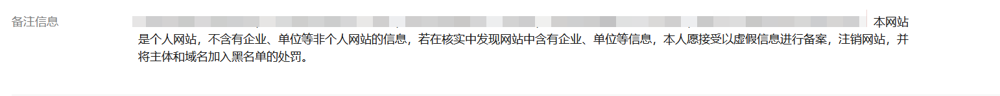
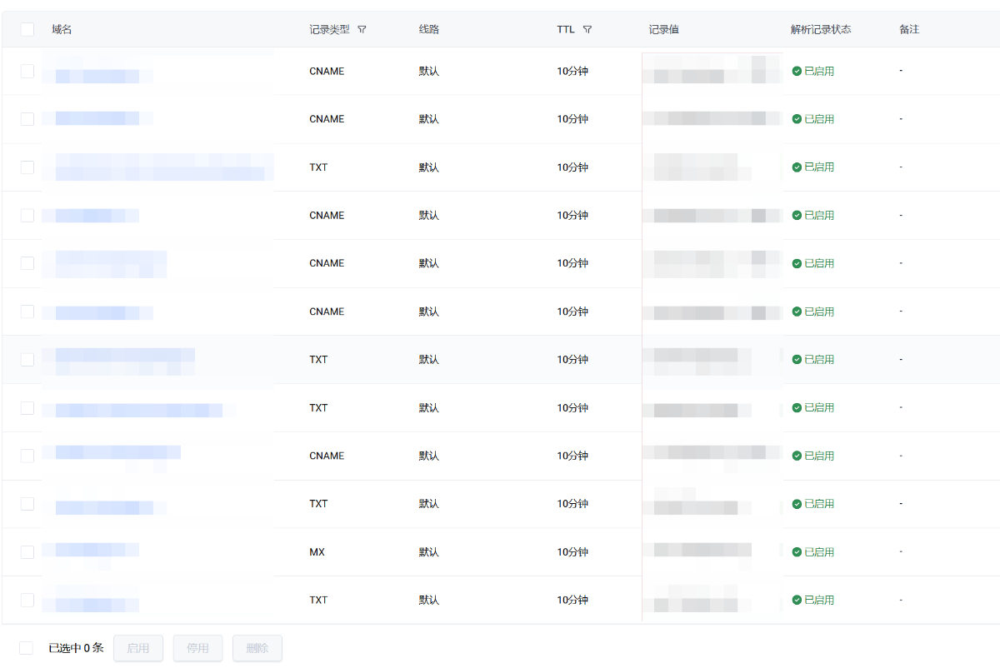
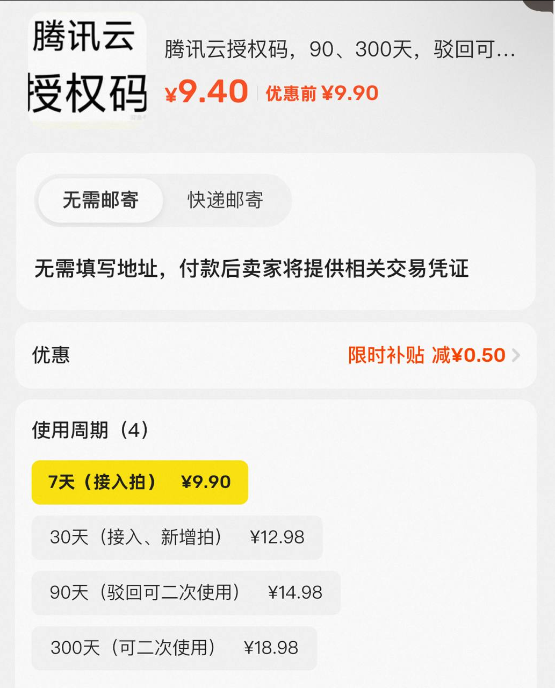

> 免责：本文仅代表本人在这几个平台备案的经历，如果你的情况和我有差异，以你的为准。

**首先，先给这几个常见的厂商评个级**

过程从易到难： 腾讯云>阿里云>华为云

成本从低到高：华为云（看个人情况）>腾讯云 >阿里云

# 一. 华为云

资料初审：★★★★☆ （星星越多代表越难，越繁琐）

后期抽查：★☆☆☆☆

总成本：≈0

## 0. 介绍

作为华为其下的云服务商，他它并不像它的母公司华为一样，割用户韭菜。华为云在玩机圈里还有着“大善人”的美誉，不知道各位薅了多少羊毛了？

如果你恰好和我一样，直接国内机十年拉满。

那么你会得到一个长达十年的零成本百分百稳定的保备案的方式而且，一个机子可以给5个域名备案（一定要选好自己常用的！）

不要像我一样，备案了没几天自己手动注消了。

都有服务器了，随便弄一个页面挂个ICP这个就不用我交了吧~ （如果有需要后面再写一个hhhhh）

## 1. 初审

如果你之前用过其他家的备案初审，再来用华为的，会发现华为云的初审服务**标准极其严格**。

其严苛程度**延伸至许多非核心信息**，对细节的要求**达到了前所未有的高度**。我最不理解的是，初审人员**主动要求用户在备案备注中添加免责声明**，这一点令人费解。

应该没有几个人能一次就过，因为真的很扣细节

初审大概在2小时左右，会回电。二次初审应该会在第二天（快的话当天整改完也会回电）

## 2. 抽查

初审严，抽查自然就宽松很多，或着说它可能完全不抽查？

以至于我都快忘了我的域名在哪里备案了。

> 因为我这个机子只有100G流量包，所以在建机之初我就套了CDN，众所周知套CDN是不符合源站IP为华为云机器的这条规定。

不过，保险起见还是保留一个二级域名，直接解析华为云服务器的IP地址，作为ICP备案待查域名。

后期大概率不会被责令整改

不要学我，直接不解析对应IP就赌他不查

---

# 二. 腾讯云

资料初审：★★★☆☆

后期抽查：★★★☆☆

总成本：10元左右

## 0. 介绍

腾讯云，没啥好介绍了吧，大家的老朋友了。在EO出来之前，腾讯云查的挺严的，基本上你如果没有解析到腾讯云的IP，很快会收到整改。

不过自从二善人出了EO了以后，备案和抽查都变得方便很多了。

## 1. 初审

在提交初审之前，我们需要有一个授权码，这个直接去闲鱼收一个就行，大概也就是10元左右

建议新增备案选择30天的 这样防止被管局审核驳回后授权码过期。

目前初审腾讯云也是松的不行，我给公司备案的时候，初审就打了个电话核实了一下，连整改都没让整改就直接提交管局了。

审核在1小时左右（工作日）基本上都能一次过不需要整改

## 2. 抽查

腾讯云这个应该是最简单的了。只要你的域名绑定EO，基本上不会被抽查。

# 三. 阿里云（最难绷的

资料初审：★★★☆☆

后期抽查：★★★★★

总成本：10元（授权码）+9元/年（OSS）

## 0. 介绍

阿里云可是之前的老牌“容易”保备案的厂商，现在反而越来越难。 不过可以看我这个教程还是可以稳定保住备案的。

[==教程直达==](https://blog.nrn.cc/archives/ICP)

## 1. 初审

阿里云的初审和腾讯云的初审都不难，基本上按要求填都能一次过。授权码基本上和腾讯云一个价格 10块钱左右。

## 2. 抽查

这就有话说了，现在阿里云严的不行（不知道是不是针对我）。如果你的备案页没有ICP悬挂（单纯解析到阿里云的IP），一样会被要求责令整改。

现在阿里云的抽查标准是，二级域名+阿里云IP+必须在底部悬挂ICP 备案号。不然一律整改。