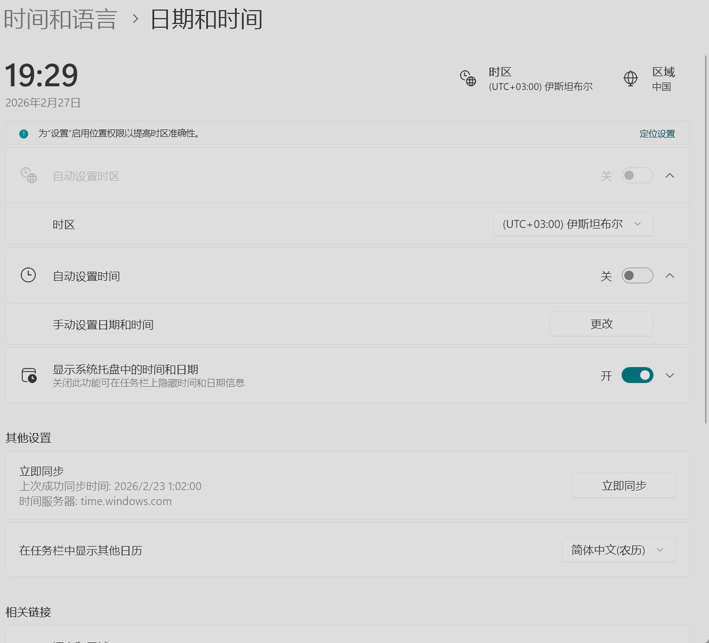
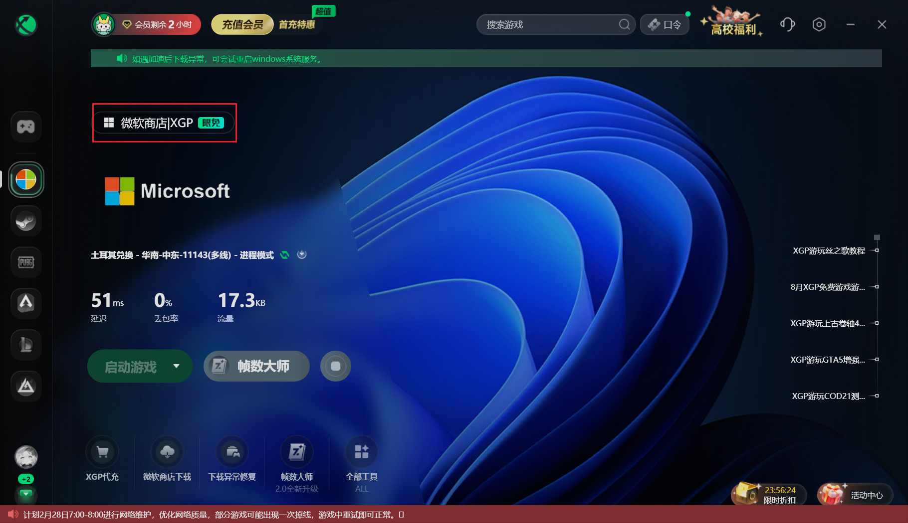
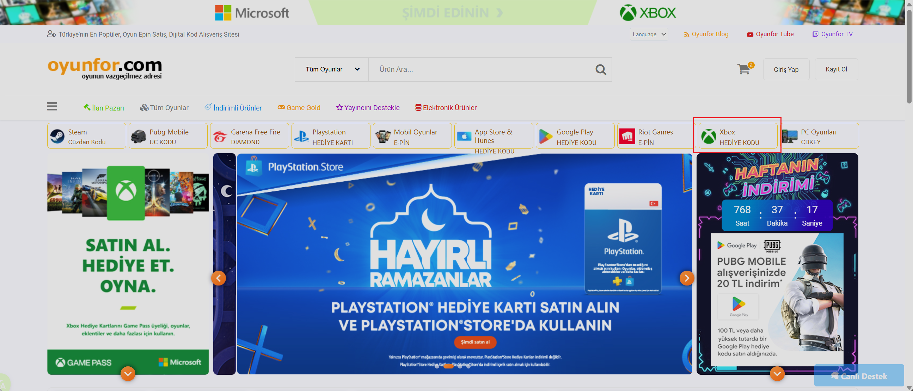
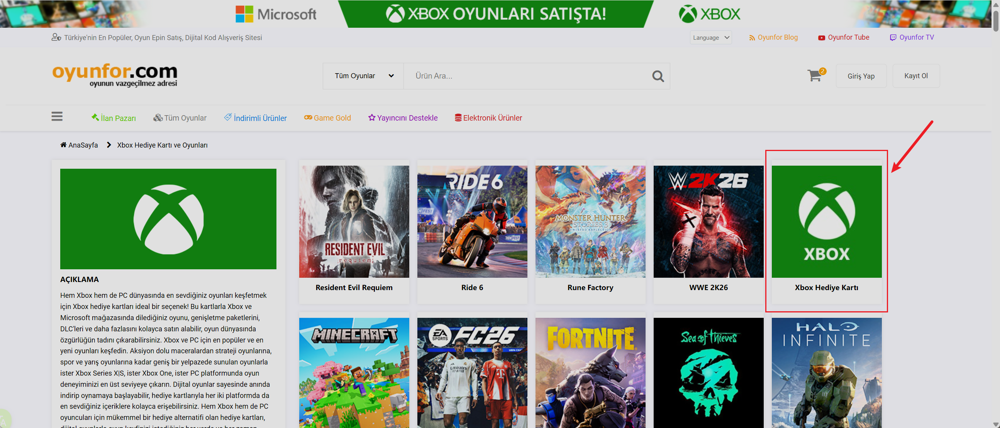
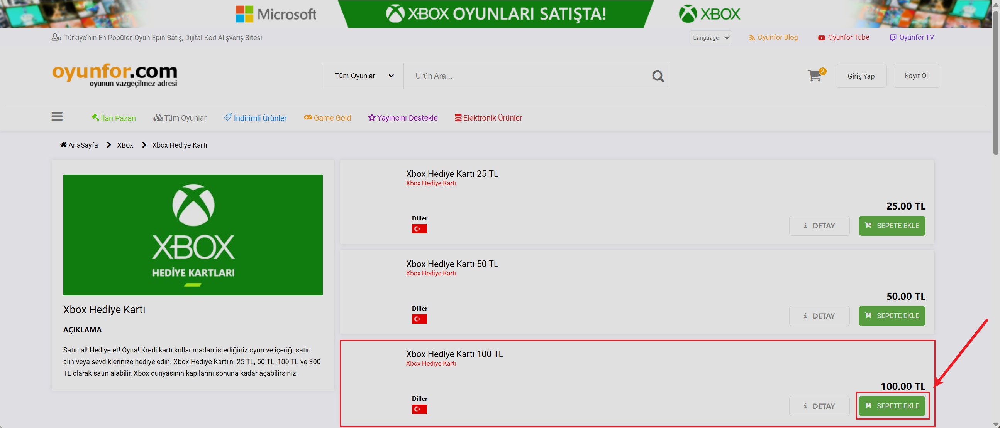
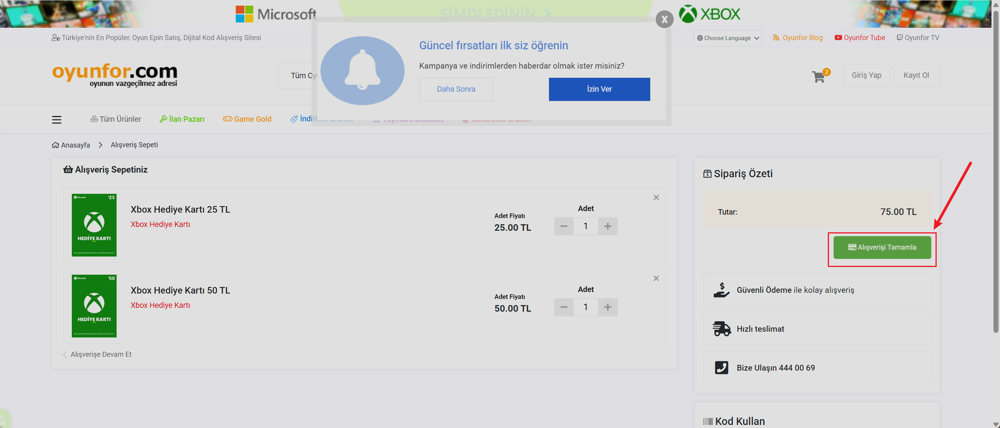
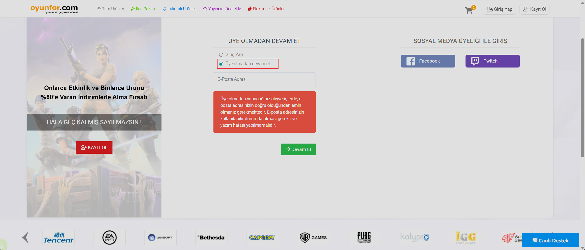
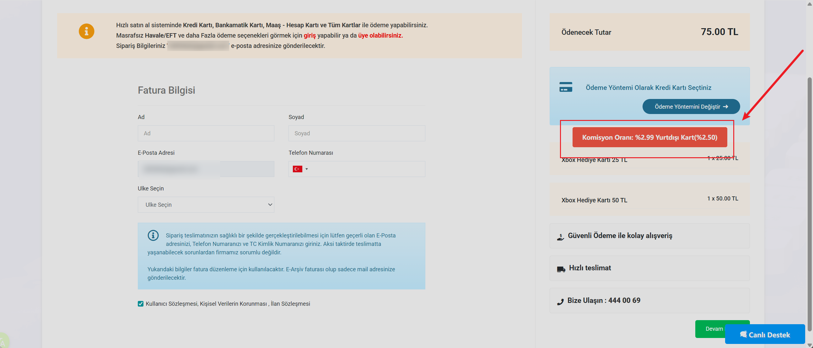
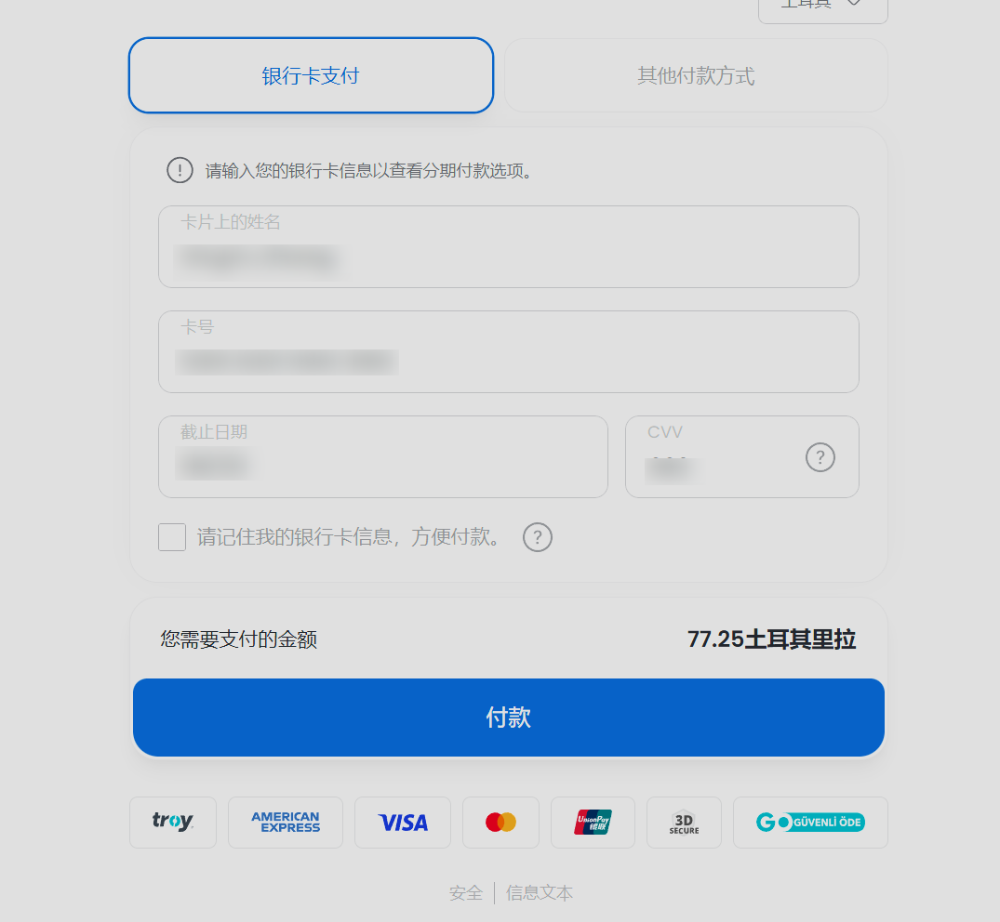
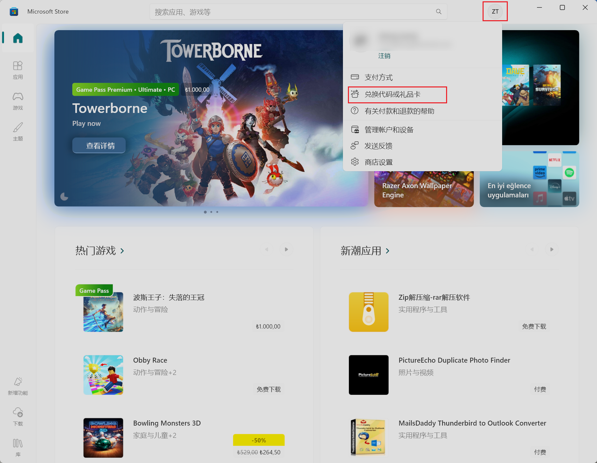

准备工作：

> 1 - 迅游加速器一只 （手机登陆就行，不需要充值）  
> 2 - Visa卡一张 （只支持visa卡）  
> 3 - win客户端一只 （虚拟机也行）  
> 4 - outlook邮箱一只 （没登陆过微软帐户的最好）

## 1. 设置时区，时间，代理均为土区

然后打开迅游xbox加速选择土耳其节点，是的 你没看错，白嫖

## 2. 买Xbox礼品卡

[https://www.oyunfor.com](https://www.nodeseek.com/jump?to=https%3A%2F%2Fwww.oyunfor.com) 节点随意，电话随意，只需要邮箱接码注册  
直接点xbox卡

100里拉

(我这里是因为之前账户里还有15里拉，就不冲那么多了，以防以后用不了)

支付页面选择第二个，然后输入邮箱

**注意，支付的时候会有2.5%的手续费**

点击继续后会跳转新页面让你填写信用卡信息

我使用的是招商万事达，过了招商的3DS认证后还要再过一个PayTR的认证，需要手机号接码，建议使用海外手机号

之后，卡密会发送到你的邮箱

## 3. 兑换Xbox礼品卡
微软store 右上角头像选择兑换代码或礼品卡，把卡密复制进去就行了

Termius登陆选择购买会跳转到store付款

教程结束~~~