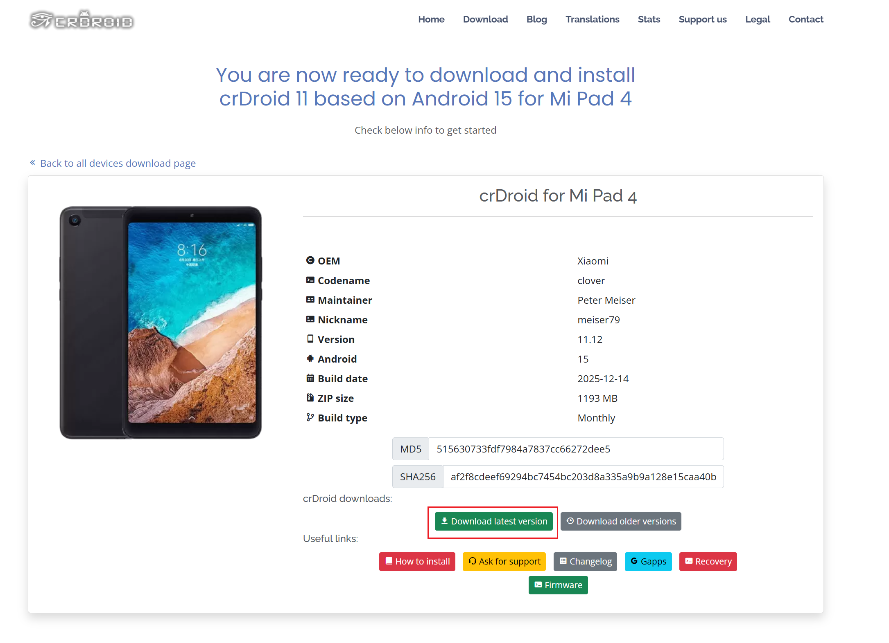
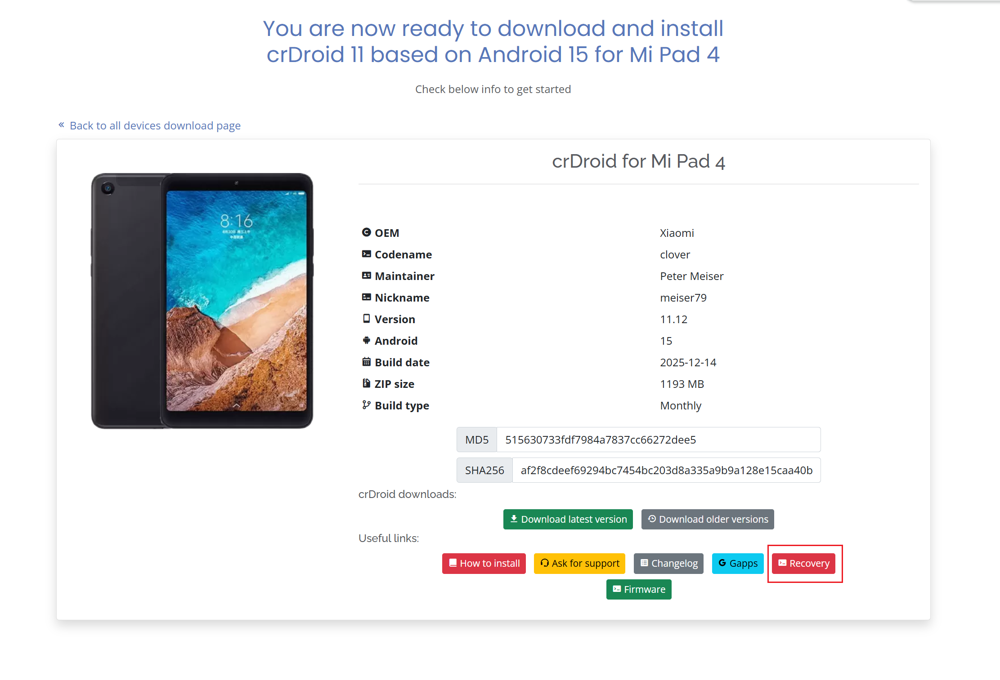

# 准备材料
1. 一台能正常开机的小米平板4
2. 一台能正常开机的win系统电脑
3. 一个灵活的大脑（处理线程≥2）
4. 一双灵巧的双手

# 教程开始

>本次我们使用的是crDroid11系统 安卓版本号是15

## 第一步·打开crDroid官网下载最新固件
https://crdroid.net/clover/11


点击下载最新版本会跳转到下载页面，等待5秒会自动下载


然后点击Recovery下载
到此新系统的准备工作就结束了
---


## 第二步·查看自己的系统是否已经解锁BL

在“开发者选项”里查看解锁状态
（图先欠着，因为我已经刷进新系统了）
如果已解锁，请跳转第三步，如果没有解锁请继续

>支持系统版本（已知如下）  
>       稳定版:版本包含及以上不能免拆解BL，版本号以下可以免拆解BL。  
>   
小米6: MIUI 9.6.3.0  
小米6X: MIUI 9.6.4.0  
小米8: MIUI 9.6.6.0  
小米8SE: MIUI 9.5.11.0  
小米8探索版: MIUI 9.6.7.0  
小米Note 3: MIUI 9.6.3.0  
小米MAX 3: MIUI 9.6.9.0  
小米MIX 2: MIUI 9.6.3.0  
小米MIX 2S: MIUI 9.6.8.0  
小米平板4: MIUI 9.6.23.0  
红米Note 5: MIUI 9.6.4.0  
>              
>   
>     开发版: 8.7.26包含及以上不能免拆解  
>   
> 版本以上系统自行拆机短接9008降级到MIUI9.6以下最好是出厂系统后再用此工具解锁BL

强解BL文件放在这里了


下面是免9009授权文件

**！！！注意，其他机型请不要使用，仅限小米平板4！！！**


## 第三步·刷入crDroid

1. 刷写恢复模式
在从官方 ROM 或任何其他自定义 ROM 刷入之前，至少应该执行一次此步骤。
- 下载并准备好支持文件(recovery)
-  在电脑上，打开命令提示符（Windows 系统）或终端（Linux 或 macOS 系统）窗口，然后输入
```
adb -d reboot bootloader
```
_（您也可以关闭设备电源，然后按住**音量下键+电源键**进入引导加载程序模式。持续按住这两个键，直到屏幕上出现“FASTBOOT”字样，然后松开。）_
- 输入以下命令，将下载的镜像文件刷入您的设备
```
fastboot flash recovery (输入前面那段 然后将recovery文件托入即可)
```
- 现在重启进入恢复模式以验证安装。不要**重启**进入现有操作系统，否则会覆盖您刚刚安装的恢复模式！

- 在设备关机状态下，同时按住**音量上键和电源键**。持续按住这两个键，直到屏幕上出现小米/POCO/红米的标志，然后松开。

_注意：如果您的恢复模式没有显示 TWRP 标志，说明您不小心启动到了错误的恢复模式。请从本节顶部开始重新操作！_

2.  刷入 ROM
**此步骤也可用于更新安装。**
- 请确保您已从上方链接下载最新的 crdroid.zip 软件包。
- 如果您当前不在恢复模式下，请重启进入恢复模式：
- 在设备关机状态下，同时按住**音量上键和电源键**。持续按住这两个键，直到屏幕上出现小米/POCO/红米的标志，然后松开。
- 对于全新安装/首次安装 - 点击**“清除”** > **“格式化数据”**，然后继续格式化过程。这将移除加密并删除内部存储中的所有文件，同时格式化缓存分区（如有）。对于更新安装，可以跳过此步骤。
- 返回主菜单。
- 请侧载 crdroid.zip 软件包，但在阅读/遵循其余说明之前，请勿重启！

然后点击挂载，将刷机包托入平板储存

再返回首页点击安装，找到刚刚的刷机包进行刷入即可。

很简单吧~

图先欠着，有空再补~